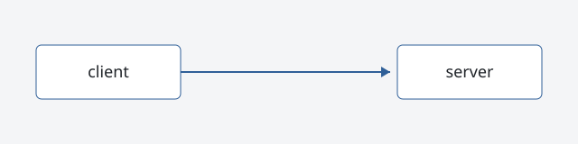

This page exists to review typography and components with `mise run dev`. It is a **draft**, so it is never part of the production build. Body text uses _Inter_, and `inline code` uses JetBrains Mono. Here is [a link](https://gohugo.io/) inside a sentence.

## A second-level heading

Paragraphs are limited to about 68 characters per line, which keeps long posts comfortable to read. Line height is generous, and spacing between blocks is consistent.

### A third-level heading

- An unordered list item
- Another item, with `code` inside
- A third item that is long enough to wrap onto a second line, to check the indentation of wrapped text

1. First step
2. Second step
3. Third step

> A blockquote. Useful for quoting documentation or someone else's words.

#### A fourth-level heading

A Go code block with syntax highlighting:

```go
// Encrypt seals plaintext with AES-GCM using a random nonce.
func Encrypt(key, plaintext []byte) ([]byte, error) {
	block, err := aes.NewCipher(key)
	if err != nil {
		return nil, fmt.Errorf("new cipher: %w", err)
	}
	gcm, err := cipher.NewGCM(block)
	if err != nil {
		return nil, err
	}
	nonce := make([]byte, gcm.NonceSize())
	if _, err := rand.Read(nonce); err != nil {
		return nil, err
	}
	return gcm.Seal(nonce, nonce, plaintext, nil), nil
}
```

A shell snippet:

```sh
mise run dev   # http://localhost:1313
```

A code block without a language:

```text
~/alessio $ ls -l blog/
```

| Option     | Pros                  | Cons                     |
| ---------- | --------------------- | ------------------------ |
| sqlc + pgx | Type-safe, plain SQL  | Code generation step     |
| GORM       | Fast to start         | Magic, runtime surprises |

---

An image from the page bundle, and a [site-relative link](/about/); both must become absolute URLs in the RSS feed:



A final paragraph after a horizontal rule.
